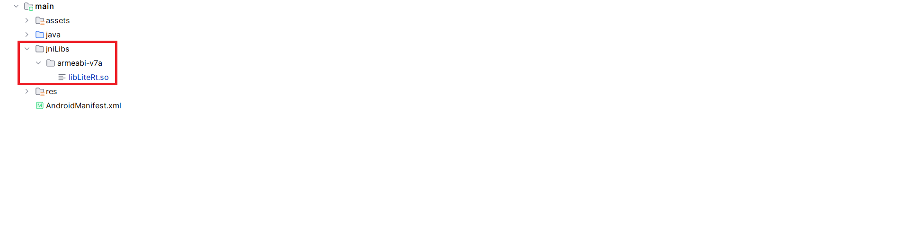

# LiteRT Android armeabi-v7a (32-bit) build guide

Guide for building **LiteRT** for **Android armeabi-v7a (32-bit)** devices using **Bazel**.

LiteRT currently focuses on **64-bit Android (arm64-v8a)** targets.
Official instructions for building LiteRT for **32-bit Android (armeabi-v7a)** are not available.

This guide documents a working approach for building LiteRT for **legacy Android devices**.

---

# Tested Environment

The build was tested with the following configuration.

| Component   | Version             |
| ----------- | ------------------- |
| OS          | Ubuntu 22.04 (WSL2) |
| Bazel       | 7.6.1               |
| Android SDK | 36.0.0              |
| Android NDK | 26.3.11579264       |
| Python      | 3.12                |
| Java        | 17                  |

---

# Compatibility

This build was tested with the following LiteRT versions.

| Component          | Version |
| ------------------ | ------- |
| LiteRT source      | v2.1.2  |
| LiteRT Android API | v2.1.1  |

The LiteRT runtime was built from **LiteRT v2.1.2** sources and successfully used with the **LiteRT Android API v2.1.1**.

Future LiteRT versions may introduce changes in the build system or runtime libraries, so some steps in this guide might require adjustments.

---

# Official Documentation

Before starting, it is recommended to read the official LiteRT documentation.

https://ai.google.dev/edge/litert/android/lite_build

https://github.com/google-ai-edge/LiteRT/blob/main/g3doc/instructions/BUILD_INSTRUCTIONS.md

---

# Clone LiteRT

Start Ubuntu (WSL2) and clone the LiteRT repository.

```
cd ~

git clone https://github.com/google-ai-edge/LiteRT.git

cd LiteRT

git checkout main
```

---
This section shows a full example of the `./configure` process for LiteRT.

# Configure Bazel

## Important

⚠️ **Running `./configure` is required before building LiteRT.**

The `./configure` script sets up the Bazel environment and generates the configuration file used during the build.

If you skip this step, the build may fail with errors related to:

* Android SDK detection
* Android NDK toolchain configuration
* Clang compiler path
* Python configuration

The configuration script generates the following file in the LiteRT root directory:

```
.litert_configure.bazelrc
```

This file contains the environment variables and build settings required for Bazel to compile LiteRT correctly.


Run the LiteRT configuration script:

```
./configure
```

Below is an example of the configuration process. Replace `<user_name>` with your actual Linux username.

Example configuration:

```
You have bazel 7.6.1 installed.

Please specify the location of python.
[Default is /home/<user_name>/anaconda3/bin/python3]:

/usr/bin/python3


Found possible Python library paths:

/usr/lib/python3/dist-packages
/usr/local/lib/python3.12/dist-packages

Please input the desired Python library path to use.

Default is [/usr/lib/python3/dist-packages]

/usr/local/lib/python3.12/dist-packages


Do you wish to build TensorFlow with ROCm support? [y/N]:
N

Do you wish to build TensorFlow with CUDA support? [y/N]:
N


Do you want to use Clang to build TensorFlow? [Y/n]:
Y


Please specify the path to clang executable:

/home/<user_name>/android-sdk/ndk/26.3.11579264/toolchains/llvm/prebuilt/linux-x86_64/bin/clang


You have Clang 17.0.2 installed.


Please specify optimization flags when "--config=opt" is used:

-O2 -fPIC -Wno-sign-compare -fno-exceptions -fno-rtti


Would you like to interactively configure Android builds? [y/N]:
Y


WARNING:
The NDK version 26 is not officially supported by Bazel.
However it works for this build.


Please specify the Android NDK API level:

27


Please specify the Android SDK path:

/home/<user_name>/android-sdk


Please specify the Android SDK API level:

36


Please specify the Android build tools version:

36.0.0
```

---

# Configuration File

After configuration, the following file will be created:

```
.litert_configure.bazelrc
```

Example content:

```
build --action_env PYTHON_BIN_PATH="/usr/bin/python3"
build --action_env PYTHON_LIB_PATH="/usr/local/lib/python3.12/dist-packages"
build --python_path="/usr/bin/python3"

build --action_env CLANG_COMPILER_PATH="/home/<user_name>/android-sdk/ndk/26.3.11579264/toolchains/llvm/prebuilt/linux-x86_64/bin/clang-17"

build --repo_env=CC=/home/<user_name>/android-sdk/ndk/26.3.11579264/toolchains/llvm/prebuilt/linux-x86_64/bin/clang-17"
build --repo_env=BAZEL_COMPILER=/home/<user_name>/android-sdk/ndk/26.3.11579264/toolchains/llvm/prebuilt/linux-x86_64/bin/clang-17"

build --copt=-Wno-gnu-offsetof-extensions

build:opt --copt=-O2
build:opt --host_copt=-O2

build:opt --copt=-fPIC
build:opt --host_copt=-fPIC

build:opt --copt=-Wno-sign-compare
build:opt --host_copt=-Wno-sign-compare

build:opt --copt=-fno-exceptions
build:opt --host_copt=-fno-exceptions

build:opt --copt=-fno-rtti
build:opt --host_copt=-fno-rtti

build --action_env ANDROID_NDK_HOME="/home/<user_name>/android-sdk/ndk/26.3.11579264"
build --action_env ANDROID_NDK_VERSION="26"
build --action_env ANDROID_NDK_API_LEVEL="27"

build --action_env ANDROID_BUILD_TOOLS_VERSION="36.0.0"
build --action_env ANDROID_SDK_API_LEVEL="36"
build --action_env ANDROID_SDK_HOME="/home/<user_name>/android-sdk"
```


# Build LiteRT for armeabi-v7a

⚠️ Make sure `./configure` was executed successfully before running the build command.

Run the LiteRT build:

```
bazel build //litert/kotlin:LiteRt \
  --config=android_arm \
  --cpu=armeabi-v7a
```

Alternatively:
```
bazel build //litert/kotlin:litert.aar \
  --config=android_arm \
  --cpu=armeabi-v7a
```

---

# Build Output

After a successful build Bazel will generate the following file:

```
bazel-bin/litert/kotlin/libLiteRt.so

```
or
```
bazel-bin/litert/kotlin/litert.aar
```

Copy the file to a convenient location:

```
mkdir -p ~/TestBazel/armeabi-v7a

cp bazel-bin/litert/kotlin/libLiteRt.so \
   ~/TestBazel/armeabi-v7a/
```
or

```
mkdir -p ~/TestBazel/armeabi-v7a

cp bazel-bin/litert/kotlin/litert.aar \
   ~/TestBazel/armeabi-v7a/
```

---

# Extract Native Libraries

The `.aar` file is a ZIP archive. You can extract it to obtain the native libraries.

Example:

```
unzip litert.aar
```

The native LiteRT libraries will be located inside:

```
jni/armeabi-v7a/
```

These `.so` files should be copied into your Android project:

```
app/src/main/jniLibs/armeabi-v7a/
```

---

# Example Project Structure

Example Android project structure after adding LiteRT:

```
app
 └── src
     └── main
         └── jniLibs
             └── armeabi-v7a
                 └── libLiteRt.so
```

Example structure is shown in the image below.




---

# Fix Linker Error

During the build you may encounter the following error.

```
ld.lld: error: version script assignment of 'VERS_1.0' to symbol 'JNI_OnLoad' failed
ld.lld: error: version script assignment of 'VERS_1.0' to symbol 'JNI_OnUnload' failed
ld.lld: error: version script assignment of 'VERS_1.0' to symbol 'google_find_phdr' failed
```

To fix this error edit the file:

```
litert/kotlin/litert_version_script.lds
```

Change its contents to:

```
VERS_1.0 {
  global:
    Java_*;
    #JNI_OnLoad;
    #JNI_OnUnload;
    TfLite*;
    LiteRt*;

  #google_find_phdr;

  local:
    *;
};
```

The important part is **commenting out** the following symbols:

```
JNI_OnLoad
JNI_OnUnload
google_find_phdr
```

After modifying the file, run the build again.

---

# Result

After completing these steps you should obtain a working LiteRT build for:

```
armeabi-v7a
```

This build can be integrated into your Android project using the generated `.aar`.

---

# Limitations

• Only **CPU execution** is available in this build.

• LiteRT GPU delegate is currently **not open sourced**, therefore GPU acceleration cannot be built from source.

• Because of this limitation, **GPU / OpenCL accelerators are not available** for armeabi-v7a builds.

• Once the GPU delegate becomes open-sourced, it should become possible to build **OpenCL acceleration** for 32-bit Android devices.

---

# Contribution Note

This guide was created while experimenting with LiteRT builds for legacy Android devices.

If official **armeabi-v7a support** is added to LiteRT in the future these instructions may no longer be necessary.
